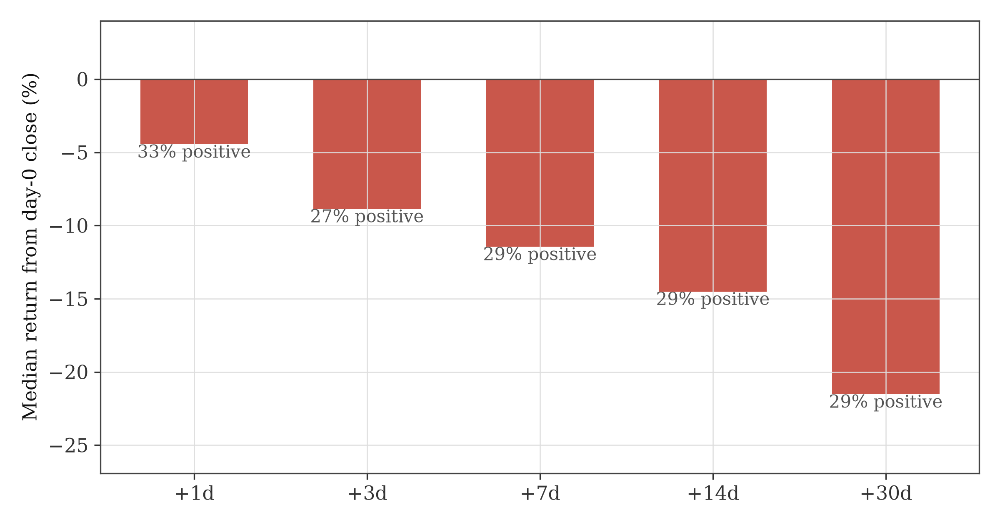
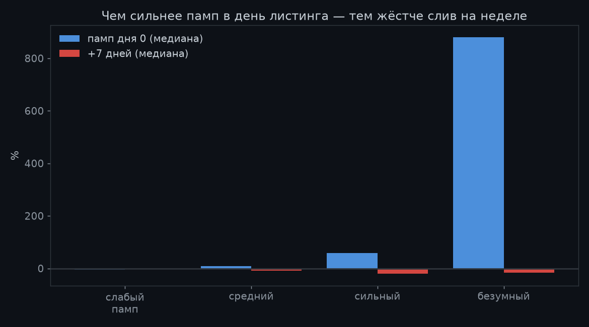
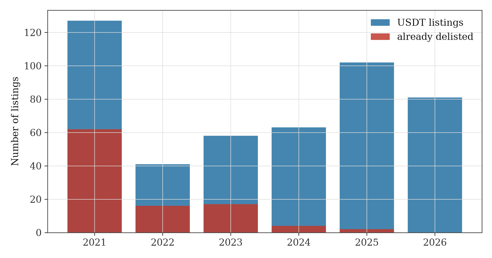

# binance-listing-study

Survivorship-aware event study of Binance spot listings (2021–2026).

Most crypto listing backtests are wrong: they use today's coin universe, silently
dropping every token that died. On equal-weight small-cap crypto portfolios that
survivorship bias inflates returns by up to **+62%/year** (Ammann et al., SSRN 4287573).

This project rebuilds the listing calendar **point-in-time from the raw
[data.binance.vision](https://data.binance.vision) archive — including delisted pairs —**
and measures what actually happens after a token starts trading.

## Key findings (n = 470 USDT listings, incl. delisted coins)

| Horizon after first trading day | Median return | % positive |
|---|---|---|
| Day 0 pop (first print → day close) | **+28.1%** | 79% |
| +1 day | −4.5% | 33% |
| +7 days | **−11.5%** | 29% |
| +30 days | −21.5% | 29% |

**The stronger the day-0 pop, the harder the fade:**

| Day-0 pop quartile | Median fwd 7d |
|---|---|
| weak (−4%) | −1.4% |
| strong (+59%) | −20.5% |
| extreme (+880%) | −16.1% |

(The gradient peaks at the third quartile and reverses for the most extreme
pops — one more reason the intraday *range*, not the signed pop, is the real
flag.)

Practical consequence: *buying listings and holding* has lottery-profile economics
(positive mean, negative median). The only robust use found so far is defensive:
exclude coins listed < 21 days from momentum universes.







## Repo layout

```
src/build_calendar.py   # walks the S3 archive index -> listing_calendar_binance.csv
                        # (symbol, first_month, last_month, delisted flag)
src/event_study.py      # price paths per event (REST for survivors,
                        # archive zips for delisted) -> event-level returns
data/listing_calendar_binance.csv   # prebuilt calendar, 3682 symbols
```

## Usage

```bash
pip install -r requirements.txt
python src/build_calendar.py     # ~10 min, anonymous S3 access
python src/event_study.py        # ~10 min, needs public Binance REST
```

## Caveats

- No historical order-book depth exists in the archive; liquidity at listing open is
  not modelled.
- Announcement timestamps are not reconstructed here — this study covers the
  post-open window only.
- Delisted coins are marked to last available close (`trunc_*` flags in output);
  treating them as −100% instead makes every horizon worse.

## References

- Ammann, Burdorf, Liebi, Stöckl — SSRN 4287573 (survivorship in crypto)
- Ante — listing announcement CAAR studies (Coinbase/Binance)
- The Tie Research — n=1844 listing event decomposition
- Ritter (1991) — IPO long-run underperformance, the 30-year-old ancestor of all this

## License

MIT
