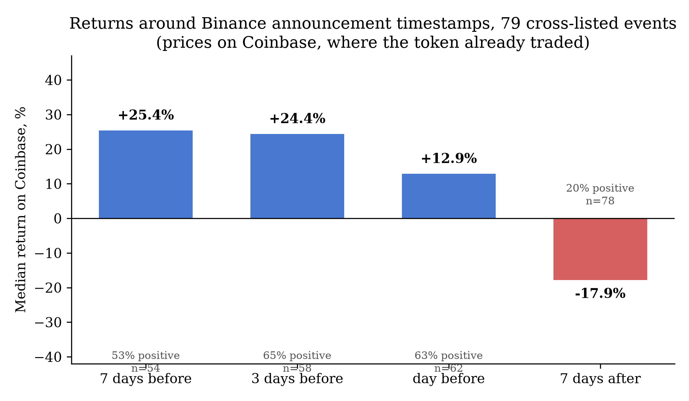
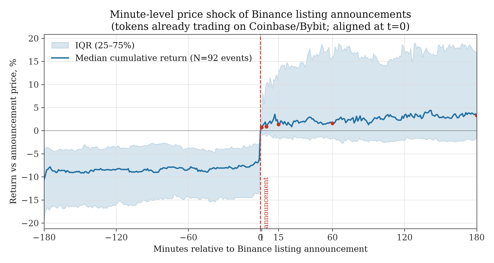

# binance-listing-study

**What does a buyer earn who purchases every new Binance USDT listing at its
listing-day close, when dead tokens are kept in the sample?**

A death-inclusive, turnover-weighted event study of all **470 Binance spot USDT
listings (Jan 2021 – Jul 2026)**, rebuilt point-in-time from the raw
[data.binance.vision](https://data.binance.vision) archive — delisted tokens
included — with a pre-specified holdout on Bybit (415 listings) and an
exploratory death-inclusive replication on Coinbase (566 listings).

## Key findings

**The fade.** From the listing-day close, the median token loses money at every
horizon (month-block bootstrap CIs all exclude zero):

| Horizon | Median return | % positive |
|---|---|---|
| +1 day | −4.45% | 33% |
| +3 days | −8.87% | 27% |
| +7 days | **−11.45%** | 29% |
| +14 days | −14.51% | 29% |
| +30 days | −21.53% | 29% |

**Tokens and dollars tell different stories.** Weighting by day-0 USD turnover,
the median week-one loss deepens to **−28.72%** (BTC-adjusted −35.46%; the
dollar-weighted mean is −17.40%), while dropping delisted tokens moves the
median by only +0.35 pp — the money evaporates while the tokens still trade.

**The fade steepens with attention.** Median week-one return by day-0 turnover
quintile: −0.6%, −5.0%, −14.5%, −16.8%, −23.5% (gradient −22.9 pp, bootstrap
CI excludes zero). The quietest quintile shows no fade at all.

**The premium is gone before trading opens.** Announcement timestamps
reconstructed from the exchange's own CMS API (468/470 events, minute-level):
the pre-announcement run-up is +24.4% over three days on venues where the token
already traded, and +9.4% in the three *hours* before publication — the listing
itself is the afterthought.

**The graveyard.** 73 true delistings: announcement day −28.5% median,
announcement-day close to last trade −51.5%, listing-to-grave −98.3% (1%
positive). Migration/rebrand notices — same genre, no death — gain +7.9%.

**Pre-specified discipline.** Four directional predictions frozen under version
control before any Bybit price data entered the repository: the fade replicates
(−10.34%, BH-adjusted p = 8×10⁻¹⁴), first-week extremes predict continuation
(r = +0.37), and the volatility-predicts-fade gradient fails to replicate —
reported as a failure.






## Reproduce

```bash
pip install -r requirements.txt
bash build_cjsj.sh    # offline: re-checks every headline number from data/ (20 checks)
```

Full pipeline (network, anonymous public endpoints only):

```bash
python src/build_calendar.py     # archive index -> listing calendars
python src/event_study.py        # price paths -> event-level returns
```

Every data artifact is listed with its generator in [`data/MANIFEST.md`](data/MANIFEST.md).

## Contents

- `src/` — calendar builders (Binance, Bybit, Coinbase), event-study engine,
  announcement-timestamp reconstruction (Binance CMS API + Telegram
  cross-validation), funding sweep, delisting mirror, minute-level day-0
  anatomy, survivorship simulation, bootstrap CIs, chart generators
- `data/` — the enriched 470×28 event panel, announcement panel (468/470),
  funding sweep (327 contracts), delisting panel (98 events), minute-level
  announcement-shock panel (92 events), survivorship-simulation panel, all CSV
- `paper/` — the manuscript (CJSJ master and submission versions),
  falsification matrix for the prior literature, verification reports
- `charts/` — publication figures
- `publish/` — the CJSJ submission package builders

## Paper

Preprint and submission: see `paper/cjsj_manuscript.md` (full) and
`paper/cjsj_submission.md` (2–3 page venue cut). DOI: _to be minted via Zenodo
on release_.

## Disclosure

Large-language-model tools assisted code drafting, debugging, literature
search, and language editing under the author's direction. No model generated
data or results; every reported number was re-derived from raw data and
verified by the author. Details in the manuscript's Methods section.

## Citation

See [`CITATION.cff`](CITATION.cff).

## License

MIT
