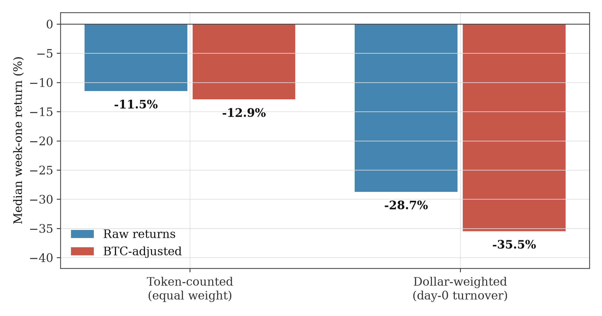
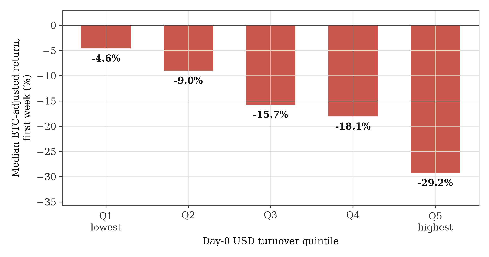

# I. Introduction

Every few days, an exchange lists a new token. Volume floods in; the chart
goes vertical. Buying that moment is crypto's most persistent folk trade, and
the emerging literature appears to support it:
cross-listings of crypto tokens on major exchanges are followed by large
positive abnormal returns, several times larger than comparable stock-market
effects [1], [2].

This paper argues that this apparent support is an optical illusion created by
how the measurement is built. Two features of standard practice do the damage.
One: the sample. Data providers and live APIs keep only tokens that still
exist, so every coin that died takes its worst outcomes with it. Two: the
window. Headline event studies straddle the listing date, so the number they
report bundles the pre-listing run-up into whatever a buyer can still get once
trading opens.

So we rebuilt the measurement. **Every**
Binance spot USDT listing from January 2021 through July 2026 went into the
calendar: 470 events, taken from the exchange's raw public archive. Tokens
delisted years ago sit in it exactly like tokens listed last month. On this
panel the typical token loses 11.45% in its first week. The typical dollar
loses about 28%. And nothing about the loss requires the token to die
afterwards.

IPO underperformance is among the oldest anomalies in empirical finance: firms
go out at prices set by their most optimistic buyers and drift below the market
for years [3]–[5]. Miller [6] supplies the
canonical mechanism: in markets where pessimists cannot easily short, prices
reflect the optimists, and valuations revert as disagreement resolves, a
prediction confirmed empirically in equities [7].
Early-market proxies of divergence (volatility, spreads, flipping ratios) predict
the depth of subsequent underperformance [8]–[10], and
the same logic extends to dollar-weighted investor experience, which trails
buy-and-hold returns whenever money arrives fastest into the most contested
names [11].

The cryptocurrency literature replicated the pattern with bigger numbers
[12]–[14], [25]. Ante [1] reports average abnormal returns of 5.7% on the listing
day and 9.2% over a (−3, +3) window across 327 cross-listings on 22
exchanges; Ante and Meyer [2] find 6.51% and 9.97% on 250 ICO-token
cross-listings. Li et al. [15] document average announcement-day returns of
+22–33% on Coinbase and Binance, noting that medians run half the means, the
signature of lottery-type payoffs. They report no reversal over 5–180 day
horizons; their object differs from ours in anchor and scope, since they date
day 0 at the announcement and price it from pre-listing cross-venue quotes,
whereas we anchor at the first trading-day close on the listing venue alone.
Industry panels agree that the premium
accrues before tokens become publicly tradeable (The Tie Research, n = 1,844
[16]).

Two points deserve sharper statement than the current literature gives them.
Firstly, the premium is front-loaded: in Ante and Meyer's own table [2], +5.0
percentage points accrue before the listing date and the subsequent (+2, +3)
window turns significantly negative; of the celebrated +9.97% window effect,
nothing is left for someone who buys at the listing-day close. Secondly, the
inference: cross-sectional t-tests assume independent events, but listing
events cluster in time and share one market factor [26], which overstates
significance materially [17], [18].

Our contribution is not to dispute those numbers but to change what is
measured. The panel is death-inclusive and covers *first* listings on one
venue only. Outcomes are anchored where a retail buyer can actually act, at
the listing-day close. Event clustering enters the inference, and the weights
follow money rather than ticker counts. To our knowledge, this is the first
academic event study of first listings that is death-inclusive,
turnover-weighted, and anchored at the buyer-accessible close; industry
panels have documented the same fade without these design features (The Tie
[16], 1,844 CEX listings; Animoca Research [28], 773 listings across five
exchanges with median returns of −40% to −70%). The
research question is single and measurable: what does a buyer earn who
purchases every new Binance USDT listing at its listing-day close, when dead
tokens are kept in the sample? Four contributions:

**Data.** We release a death-inclusive listing calendar for the Binance
spot market, January 2021 through July 2026 (3,682 symbols screened; 470
USDT events retained, delisted tokens included), together with a parallel
calendar for Bybit (829 USDT listings). Both were rebuilt from the raw
archives and released openly with a 28-feature event dataset.

**Evidence.** Taking the day-0 close as the reference point, the median
forward return is negative at every horizon from +1 to +30 trading days, with
nonparametric significance between 10⁻¹³ and 10⁻¹⁹, unchanged under tail
trimming, winsorization, subsample exclusion or month-block clustered
inference.

**Mechanism.** Week-one losses deepen monotonically in day-0 USD turnover:
the listing-day version of the divergence-of-opinion underpricing known from
IPOs since Miller [6] (Section III.H).

**Discipline.** Before touching any Bybit price data, we formulated four
directional predictions and tested them on a survivor-only cohort with
multiple-testing correction, reporting both the replications and the failures.
One headline result from our own exploratory analysis (that day-0 volatility
predicts the fade) did not survive its own confirmation attempt, and we say so.

# II. Methods

## A. Data: calendar construction and sample

Binance publishes monthly k-line archives for every symbol it has ever listed
to a public file archive (data.binance.vision), including symbols delisted
years
ago. We divided the archive index into pages (3,682 folders, one per symbol),
restricted the scope to daily candles, recorded the first and last months for
each symbol, and flagged symbols that dropped off the list (their time series
ended more than one month before the query date). The archive index was
retrieved in August 2026; all counts below refer to that snapshot.

The funnel: 3,682 archived symbols, then 722 USDT spot pairs, then 670 after
removing the 52 symbols matching the leveraged-token suffixes
(UP/DOWN/BULL/BEAR), then 468 with a first listing from January 2021 onward.
The suffix pattern also catches two non-leveraged symbols, JUP and SYRUP,
whose tickers happen to end in "UP"; restoring them gives the analysis panel
of **470 events**. Including or excluding them shifts no reported median
by more than 0.1 pp. A listing here is the debut of the USDT pair: 59 events
traded earlier on Binance under another quote currency (re-pairings), and the
panel knowingly includes 56 tokenized-stock and 5 stablecoin-cross pairs from
the 2026 waves; Section III.E reports the clean panel (n = 350) alongside.

## B. Event study specification

Events are dated at the token's first trading day on Binance (day 0). Simple
returns are $R_{i,t} = P_{i,t} / P_{i,t-1} - 1$; forward returns are
$FWD_{i,k} = P_{i,k} / P_{i,0} - 1$ for $k \in \{1, 3, 7, 14, 30\}$ trading
days. Horizons are counted in the token's own daily bars, so every event
shares the same clock from its first print. The convention carries over
unchanged to the Bybit holdout of Section III.H. The event-study design
follows the standard framework of MacKinlay [19].

A first listing has no venue history. Expected returns therefore cannot come
from a pre-event window on the listing venue itself. The prior literature did
not face this constraint, since its data provider aggregated pre-listing
trading from other venues. We therefore use the market-adjusted model with
Bitcoin, the sample's dominant common factor, as the reference asset,

$$AR_{i,t} = R_{i,t} - R^{BTC}_t, \quad CAR_i(0,k) = \sum_{t=0}^{k} AR_{i,t}$$

and report simple forward returns, if only to stay comparable with the
headline tables of the cross-listing literature.

Inference rests on four layers. (i) A cross-sectional t-test on event-level
CARs. (ii) The Wilcoxon signed-rank test, robust to the heavy right tail.
(iii) A month-block bootstrap (listing months resampled with replacement,
5,000 draws, percentile intervals), because listing events cluster in time.
(iv) Benjamini-Hochberg correction (q = 0.05) across the confirmatory
hypothesis family {H1, H2, H3}. The Bybit holdout design is documented with
its results in Section III.H. Large-language-model tools assisted code
development and manuscript editing under the author's direction (full
disclosure in the Acknowledgements).

## C. Variables

**Table I.** Key variables (all computed from daily bars of the listing venue
archive unless noted).

| Variable | Definition |
|---|---|
| `pop_day0` | Day-0 close-to-open return: $C_0 / O_0 - 1$ |
| `range_day0` | Day-0 intraday range: $(H_0 - L_0) / O_0$ |
| `quote_vol_day0` | Day-0 volume (base-asset units; label inherited from pipeline) |
| `usd_turnover` | Day-0 quote-asset volume in USD (from archive, field 7) |
| `fwd_k`, `trunc_k` | Return from day-0 close to day-`k` close; truncation flag if path ends early |
| `max_daily_7d` | Largest daily return within the first week |
| `ann_vol_7d` | Annualized standard deviation of first-week daily returns |
| `vol_usd_7d_avg` | Mean daily volume over the first week |
| `delisted` | 1 if the symbol's history ended before retrieval |

## D. Price paths, truncation, and turnover

Daily OHLCV paths come from REST klines where a symbol still exists; for the
rest, we stitched monthly archive zips together (the platform moved its
timestamps from milliseconds to microseconds in 2025; the stitcher handles
both). Where a path ends before a horizon (this affects only ten recent
listings, recency censoring, not the delisted names), the return is marked
at the last available close and flagged; setting truncated observations to
−100% instead would worsen every estimate, so the conclusions are
conservative either way.

We also pulled day-0 turnover in US dollars for all 470 events (the
quote-asset volume of the first daily candle) from the same archive. Most
derived datasets do not carry this field. Without it there are no
dollar-weighted results below. (A listing opens intra-day, so the first daily
bar can be partial; the minute-level anatomy of day 0 is analysed in Section
III.A.) Dollar-typical outcomes below are weighted medians with weights equal
to day-0 USD turnover: the smallest value at which cumulative weight reaches
50%. This is a weighting choice, not an internal-rate-of-return measure in the
sense of Dichev [11].

# III. Results

## A. The fade

{width=100%}

**Table II.** Forward returns from day-0 close (n=470).

| Horizon | Median | Mean | t-stat | Wilcoxon p | %>0 |
|---|---|---|---|---|---|
| +1d | −4.45% | −1.35% | −1.22 | 7.9×10⁻¹³ | 32.6% |
| +3d | −8.87% | −3.44% | −2.21 | 9.98×10⁻¹⁶ | 27.4% |
| +7d | −11.45% | −6.65% | −3.72 | 3.38×10⁻¹⁷ | 28.9% |
| +14d | −14.51% | −9.68% | −4.77 | 8.59×10⁻¹⁹ | 28.9% |
| +30d | −21.53% | −7.29% | −1.71 | 1.03×10⁻¹⁸ | 29.1% |

Bootstrap confidence intervals of the medians exclude zero everywhere. Note
the mean/median asymmetry: at +30d the mean (−7.29%) cannot be told apart
from zero, because a thin right tail of spectacular winners offsets it. This
is the lottery structure that makes "average listing
return" marketing misleading. The drift is stable across halves of the sample
(Mann–Whitney p = 0.27–0.33 across split conventions).

The drift also settles a piece of trader folklore: "buy the dip, it
always bounces." The median token bottoms at **−31.78%**
within its first month, and thirty days after listing the median return is
still −21.53%. Even an investor who caught the exact bottom of the first month
would, at the median, still sit far below the listing-day close.

A permutation test adds context. The null pools the forward returns of all
events at all horizons, so that day-0 timing carries no information, and
compares each observed horizon median against the medians of 2,000 random
draws from that pool: the +1d and +3d medians do not differ from
the pooled distribution (p = 1.00; 0.79), whilst the +14d and +30d
medians exceed every draw (0 of 2,000; empirical p < 5×10⁻⁴, the resolution
floor of the design). The headline +7d median does not clear the pool
(p = 0.06). The test separates the late-horizon drift from pooled market
days, but does not by itself rule out a market-wide post-peak regime.

Zooming inside day 0 sharpens the picture. Across all 470 events
(minute-level bars from the same archive), the median listing gains +30.9% in
its first hour and then drifts −2.25% lower by the close; 84.0% of events
rise in the first hour and 61.3% fall afterwards. The day's price peak is the
very first minute bar for the median event (80.4% of events peak within the
first hour), and the first hour carries a median 38.2% of the day's dollar
volume. Even the opening print is already past the peak: the median first
minute closes +38.1% above the open. What marks the frenzy is intensity, not
buyer imbalance: a median 3,858 trades per minute in the first five minutes
(median of per-event ratios; the ratio of medians is 13.7×),
and the quartile with the busiest first hour
fades −21.9% within a week against −0.7% for the quietest (Spearman
ρ = −0.28, p = 3.8×10⁻¹⁰). The frenzy is concentrated at the open; the
listing-day close, where
this paper anchors outcomes, is already past it.

## B. Volatility, not the pop

{width=100%}

Univariate quartiles suggest listings with bigger day-0 pops fade harder:
−1.4% median next week in the weakest pop quartile, −20.5% in the third. The
trend then reverses. The quartile with the largest day-0 pop (median increase
on day 0: +880 per cent) fades less (−16.1 per cent) than the third quartile.
Regression separates the candidates (variable definitions in Table I):

**Table III.** OLS, dependent variable fwd_7 (%). N=470, R²=0.35.

| Term | Coef | t-stat |
|---|---|---|
| log day-0 pop | **+9.40** | 3.44 |
| log day-0 high–low range | **−8.40** | −5.14 |
| log day-0 volume | −0.26 | −0.70 |
| first-week annualized vol | +12.70 | 15.57 |
| delisted dummy | +3.45 | 0.94 |

Conditional on the day-0 range, the signed pop turns mildly positive: the
one-dimensional gradient reflects the co-movement of extreme pops and extreme
intraday ranges. One caution that anticipates Section III.H: the −8.40
estimate depends on the annualized-volatility control, itself measured over
the outcome window, so the regression is a decomposition of co-movement, not
a prediction (without that control: −3.23, t = −1.67); the holdout returns a
verdict on it.

## C. Survivorship: bounded here, large elsewhere

Within our archive-based panel, dropping delisted tokens moves the +7d median
by only +0.35 pp; the archive keeps the dead paths, so little hides there. The
warning is for samples assembled from live-universe endpoints, where every
token that died before sampling disappears entirely: with 70% of week-one
outcomes negative, Ammann et al. [20] put the inflation for equal-weight
crypto portfolios at up to 62 pp per year. They report the opposite weighting
asymmetry, with value-weighted portfolios inflated by only 0.93 pp per year;
the two facts reconcile, since their weights are market capitalizations in a
buy-and-hold portfolio compounded over years, where dead coins carry
negligible weight, while ours are day-0 turnover shares in a short event
window, concentrating weight on the hottest listings. A monthly simulation of
that
sampling rule on our own panel quantifies the warning, with deaths taken
point-in-time from each pair's last trading month in the exchange calendar:
rebuilt as a live-API user would have seen it on each past date, the
equal-weight week-one median shifts by at most ±1.5 pp and never flips sign,
the dollar-weighted median shifts by at most +1.9 pp (May 2025), and the
share of events that had vanished from view peaks at 23% of the panel. Even
at its worst point the live-API panel would have shown a dollar-weighted
week-one median of −28.7% against the true −30.6%, leaving the fade
conclusion intact. Section III.H pushes further: even
in a panel that remembers the dead, survivorship reshapes results once the
dollars are counted.

The death events themselves close the loop. For the 73 true delistings with a
located announcement (98 of 99 delisted panel members are dated; migrations
excluded), the announcement day loses −28.5% at the median (5% of events
positive), the price halves again from announcement to the last trade
(−51.5%), and buying the listing and holding to the grave loses −98.3% at the
median (1% positive). Migration and rebrand notices, the same genre without
death, gain +7.9% on their day (76% positive): the reaction is specific to
dying, not to the headline. There is no pump before the dump.

## D. Application: what survives validation

As an application, the findings were embedded in a pre-existing daily momentum
system over the liquid meme sectors; the only change motivated by this study
is the exclusion of listings younger than 21 days (Table II), adopted as a
defensive rule. The validated candidate table, with accepted and rejected
verdicts, is in the companion repository (`paper/STRATEGY_VALIDATION.md`);
all strategy numbers are in-sample upper bounds, and live tracking continues.

## E. Robustness

For +7 days, the median still lies within the interval [−11.52 per cent,
−11.31 per cent] under a 2 per cent tail trim, winsorization (capping
extremes at the percentile boundary), excluding 2021
(the meme craze) and excluding the fourth quarter of 2024. In every case the
p-value of the Wilcoxon test is at most 1.5 × 10⁻¹³. Excluding the 59
re-pairing events and the 61 non-token pairs strengthens every number:
week-one median −14.32%, month-one −30.99%, all Wilcoxon p ≤ 2.5×10⁻¹⁴, and
the dollar-weighted week-one median is unchanged (−28.89% vs −28.72%), so the
headline numbers are conservative. Relative to round-trip
retail spot costs of ~16 bps, the
median absolute move is an order of magnitude larger. Monetizing the negative
sign is harder than the drift suggests. A full sweep of perpetual-funding
histories (327 of the 470 names have a contract) shows week-one funding
rarely eating the drift: the median weekly funding sum is −0.36% against the
−11.45% median drift, and only 17.7% of day-0-shortable names lose more than
half the drift to funding (the sign of funding flips by era: shorts were
paid in 2021 and 2023–24, and pay in 2022 and from 2025). The binding
constraints are access and the upside tail: a
day-0 short is possible for only 17.0% of the panel (44.7% within week one; a
third of contracts list more than 30 days after spot), and on the twelve
most-traded listings with a perpetual contract available from day 0 the
median week-one short earns +25.6% while the mean earns +16.0%, the gap
driven by two names whose post-listing rallies erased the drift (per-name PnL
net of funding and costs: `data/short_pnl_check.csv`). Funding itself carries
the hype signature: names where shorts pay
fade deepest (Spearman ρ = +0.16 between week-one funding and the week-one
return, p = 0.016, n = 221). The frame is perpetuals-only; spot borrow
availability is worse, so the access numbers are upper bounds.

## F. Cross-venue sequencing and lottery features

A point-in-time Bybit spot calendar adds 829 USDT listings since 2022 (49.5%
already delisted); 205 of our 470 Binance events (44%) also trade there, and
cross-venue order carries no signal (Mann–Whitney p = 0.20). Within the first
week, tokens with extreme single-day up-moves do *better* at +30d, −13.4% vs
−20.7% (corr(max_daily_7d, fwd_30) = +0.32): the attention-continuation logic
of the MAX effect [21], not instant lottery exhaustion.

## G. Dating the announcements, and where the premium sits

Had the premium accumulated by the time of the *announcement*? The question
needs announcement timestamps, and public web crawls fail to provide them:
across all 71 Common Crawl collections (2019–2026), only 38 of 470 events
have any matching candidate, the nearest surfaces 70 days *after* the listing
and the median +544 days later; crawl dates are discovery dates, not
publication dates.

The exchange's own infrastructure solves the dating problem. Binance's public
content API, the catalogue behind its announcement pages, returns a
millisecond-precision publication timestamp for each of 2,255 catalogue
articles back to 2017 (plus six rescue notices outside the catalogue).
Matching articles to panel events by title and body
patterns (direct announcements, airdrop and launchpool introductions, pair
additions, rebrand notices) dates 468 of 470 events (99.6%), cross-validated
against the exchange's independent Telegram announcement channel (20-event
random subsample; median absolute disagreement: 2 minutes). The
announcement falls on the listing day itself for 62.8% of events and within
one day for 78.0%. The two undated events (NBT, MULTI, both delisted) appear
to be quiet pair additions with no public announcement at all.

The lag is informative in an unexpected direction. The week-one fade is
statistically indistinguishable across lag groups, from same-day
announcements to ramps longer than a week (−10.3% to −13.4%
by raw group; Kruskal-Wallis p = 0.51): the market dumps the listing no matter how long it
was anticipated. What the lag does predict is the day-0 pop (Spearman
ρ = +0.32 for lags within a week, +0.17 across all 468 dated events),
through the launchpool mechanic: announced farming
periods between announcement and listing produce median day-0 pops of
+1215.8% (n = 65).

With timestamps in hand, the pre-announcement premium becomes measurable on
venues where the token already traded. 79 events have a Coinbase price
history around the announcement day (usable n varies by window: 54–62
before, 78 after). The median return on Coinbase is
+12.9% on the day before the Binance announcement and +24.4% over the three
days before it (Wilcoxon p = 2.4×10⁻⁹, n = 58; 87.9% positive); the seven
days after the announcement revert to a −17.9% median (n = 78; Fig. 3). This
subsample is selected (tokens already large enough to trade elsewhere) and
the exercise is exploratory, but the direction is unambiguous: the premium
accrues before the announcement, in someone else's market. The folk trade
buys the tail of it.

{width=100%}

Minute-level data around the exact timestamps closes the loop. For the 92
events with a pre-existing market on another venue (Coinbase 61, Bybit 31),
the median return is +9.4% over the three hours *before* the announcement
goes public and +3.3% over the three hours after; about 7 percentage points
of the run-up print in the last fifteen minutes before publication, and 90%
of pre-window events are positive (Fig. 4). The pattern is identical on both
venues, and a flat three-day run-up on the same venue rules out plain
momentum selection. (A Telegram-timestamped subsample is uninformative here:
n = 5, mostly rebrand notices.) The
market learns of the listing before the announcement, consistent with the
insider-trading estimates of Félez-Viñas et al. [24], who place informed
trading before 28–48% of listings; the publication itself
is the afterthought.

{width=100%}

## H. Pre-specified confirmatory holdout: Bybit

The Bybit holdout was designed before the fact. Four directional predictions
were written on 2026-08-23 and frozen in version control on 2026-08-24,
before any Bybit price data was touched. Three
transplant the Binance findings to Bybit and form the multiple-testing family,
corrected with Benjamini-Hochberg (q = 0.05); the decision rule is dual:
adjusted p < 0.05 plus the predicted direction. The fourth (H4) is a
survivorship decomposition on the Binance panel and sits outside the
corrected family (Table IV collects the family's raw and adjusted p-values).
The cohort is the frozen Bybit USDT calendar, cut down to
still-tradeable symbols: Bybit's API serves klines only for listed
instruments, so the holdout runs on survivors (419 candidates; 415 usable;
limitation declared upfront). Features copy the Binance pipeline.

**H1: the fade replicates.** Median return from day-0 close at +7 days:
**−10.34%** (Binance death-inclusive: −11.45%; Binance survivors only:
−11.11%). Wilcoxon p = 5.4×10⁻¹⁴; 27.5% of tokens are positive after a
week.

**H2: volatility predicting the fade does not replicate; the sign flips.**
On Bybit survivors the log-range coefficient is **+4.65 pp (t = +2.69)**
against −3.23 (t = −1.67) on Binance in the like-for-like specification
(−3.47, t = −1.76 under the frozen controls, which add the delisting flag).
Adding the volatility control collapses the Bybit coefficient to +1.43
(t = 0.90, n.s.) while sharpening the Binance one to −8.40 (t = −5.14). The
gradient is specification-fragile on both venues; we
report this as genuine cross-venue heterogeneity under survival conditioning
that generates hypotheses rather than supports them. (One
declared deviation: the pre-specified control for the delisting flag was
dropped, because among survivors it is identically zero.) A calibration note:
the frozen prediction band [−15, −5] pp was taken from the specification
with the volatility control, while the frozen test runs without it; on the
frozen specification the Binance estimate itself (−3.47) sits outside the
band, so H2 would have failed its decision rule on the discovery sample too.

**H3: extremes mark continuation.** The largest daily gain of week one and
fwd_30 correlate at **+0.373** (predicted band +0.2…+0.4). Top-MAX tercile
median fwd_30 is −6.74% versus −17.81% in the bottom tercile (Mann–Whitney
p = 0.0024).

**Table IV.** The confirmatory family (written 2026-08-23, frozen in version
control 2026-08-24), Bybit cohort
(n = 415): raw and Benjamini-Hochberg-adjusted p-values.

| Hypothesis | Test | Raw p | BH-adjusted p | Direction as predicted | Verdict |
|---|---|---|---|---|---|
| H1: the fade replicates (+7d) | Wilcoxon | 5.4×10⁻¹⁴ | 8.1×10⁻¹⁴ | yes | replicates |
| H2: day-0 range predicts the fade | OLS, like-for-like | 7.4×10⁻³ | 7.4×10⁻³ | no: sign flipped | does not replicate |
| H3: extremes mark continuation | Pearson, one-sided | 1.9×10⁻¹⁵ | 5.6×10⁻¹⁵ | yes | replicates |

**H4: the survivorship decomposition, done in dollars.** Excluding delisted
tokens shifts the Binance median fwd_7 by +0.35 pp (bootstrap CI [−1.27,
+2.15]; prediction ≥ +1 pp): the frozen prediction fails. With true day-0 USD
turnover weights for all 470 events,
real dollar weights the week-one picture splits in two: token-counted median
−11.45%, dollar-counted median **−28.72%** (month-block bootstrap 95% CI
[−39.45, −19.79]; −35.46% BTC-adjusted, CI [−49.32, −22.31];
Fig. 5), and the
delisting-attributable wedge is just **+0.96 pp** (CI [−3.41, +3.24],
statistically indistinguishable from zero). The dollar-weighted mean,
−17.40%, sits far above the median: a thin right tail of winners carries part
of the money. High-turnover listings fade
harder whether or not they die afterwards.

{width=100%}

The gap has anatomy. Split the panel into day-0 turnover quintiles and the
median week-one return runs −0.6%, −5.0%, −14.5%, −16.8%, **−23.5%** (Fig. 6;
month-block bootstrap 95% CIs [−7.2, +0.7], [−14.2, −1.9], [−20.5, −6.1],
[−26.0, −13.0], [−33.2, −14.9]; gradient Q5−Q1 = −22.9 pp, CI [−32.6,
−13.3])
(BTC-adjusted: −3.5%, −8.5%, −15.3%, −19.8%, −29.1%). The
quietest quintile shows no fade at all. Turnover also correlates with day-0
range (Spearman rank correlation +0.84) and pop (+0.79), keeps incremental
predictive power in
cross-section (−2.4 pp per log-unit, t = −2.6), persists in every calendar
year, and survives removal of the five heaviest events. This is the listing-day
version of the divergence-of-opinion mechanism [6], [8]–[10]: record turnover
marks
peak attention [22], optimists set the
price, and dollars systematically buy that peak.

{width=100%}

An exploratory third-venue check reinforces the holdout. Coinbase Exchange
keeps delisted instruments in its public API, so a second death-inclusive
calendar can be built: 566 USD- and USDT-quoted listings from January 2021
onward, 171 of them since delisted. The fade replicates almost exactly:
median forward returns from the day-0 close of −4.49% at +1d, −12.24% at +7d
(Wilcoxon p = 6.6×10⁻³⁵) and −22.26% at +30d, against −4.45%, −11.45% and
−21.53% on Binance; robust to base-asset deduplication, to the 2021–2023
versus 2024+ split, and to the survivors-only subsample. This check was not
pre-specified; we report it as exploratory.

# IV. Discussion

For the literature, the widely cited listing premium, whilst real as a
statistic, is misleading as a signal. In reality it measures "anticipatory
accumulation": actions taken before retail investors can act, whether informed
or merely early. Virtually all post-opening
windows in Ante and Meyer's own table [2] are negative (the sole exception,
the day +3 return of +0.25%, is statistically insignificant), and on the panel used in
this study (which keeps delisted tokens in the sample), the post-opening,
buyer-accessible component of the effect inverts
entirely.

Traders get a different object out of these numbers: the expected loss varies
monotonically with the trading volume on day 0 (Fig. 6), and surviving past
the listing does not rescue it. The anomaly lives in the attention a listing
draws, not in the act of listing itself [27]. Shorting the fade is mostly
uneconomical [23]: the binding constraint is access, not funding
(Section III.E).

The measurement lesson is the most general one. The equal-weight median
answers the question "what happens to a typical token?", whilst the
turnover-weighted statistics answer the question "what happened to the
money?". Here they disagree by 17 percentage points, and the
disagreement itself is the finding. An event study that reports only one of
them is leaving the reader half-blind, and any study drawing its sample from
live APIs is studying a different market than the one traders experienced.

These measurements are also used to test the claims accumulated in the
specialist literature, i.e. as a falsification pass. The canonical listing-day
statistics are *real*; we verify the +6.51% of Ante and Meyer [2] and the
+22–33% means of Li et al. [15] exactly as published. The trading
interpretation built on them
is not: medians run at half the means, and the fade
concentrates where turnover peaked. The full matrix, claim by claim with
verbatim quotes and replication verdicts, lives in the companion repository
(`FALSIFICATION.md`).

**Limitations.** (1) The primary panel is one venue; the Bybit holdout is
restricted to survivors by that venue's API, and the Coinbase check (Section
III.H) is exploratory and mostly USD-quoted. (2) The pre-announcement
exercise (Section III.G) is exploratory and limited to tokens already trading
on another venue (n = 79). (3) The range→fade sign
flip across venues (H2) is documented, not explained. (4) No historical
order-book depth exists publicly; liquidity enters only through volume
proxies. (5) Backtest costs (8 bps round-trip, against the ~16 bps retail
spot benchmark of Section III.E) likely understate slippage in
stress regimes. (6) The `last_date` field hits the 1,000-day REST cap for
175 of 470 rows; all death information in the paper comes from the listing
calendar instead. (7) Events are dated by the USDT pair's debut: 59 of 470
are re-pairings of assets that traded earlier under other quotes, and 61
entries are tokenized-stock or stablecoin pairs; the clean panel (n = 350)
strengthens all results (Section III.E).

Three extensions follow directly. Live tracking of the momentum stack of
Section III.D continues, replacing the in-sample upper bounds. The
announcement panel opens the full pre-announcement window: minute-level
measurement around the announcement timestamp, and order-flow data where it
exists. The sign flip of the volatility gradient across venues (H2) calls for
a mechanism explanation.

# V. Conclusion

An analysis of every USDT token listed on Binance's spot market between 2021
and 2026 (the data was rebuilt so that no dead coin can drop out of the
sample) shows that prices tend to fall during the first week after listing
(−11.45% in token terms, −28.72% in dollar terms). Furthermore, the decline
is concentrated monotonically where attention and trading volume
peaked. A pre-specified holdout confirms the fade and the continuation effect
of first-week extremes on a second venue, and an exploratory death-inclusive
check on Coinbase (566 listings) reproduces the fade almost exactly. The
volatility-fade gradient fails
to confirm: the estimate is fragile in both venues' data. Survivorship bias
operates through a "gateway" mechanism: it determines from the
outset which tokens will be included in the sample at all, a greater impact
than it has on the weekly median of
the tokens already measured. Finally, the practical
conclusion fits in one line: by the time a listing becomes tradeable, the
trade everyone knows about has already happened.

# Acknowledgements

This work was carried out under the academic supervision of Sergey Solntsev,
PhD in Economics, Deputy Head of the Laboratory for Labour Market Studies,
Assistant Professor at the Faculty of Economic Sciences, National Research
University Higher School of Economics. We thank Binance, Bybit and Coinbase
for maintaining public market-data archives. Disclosure of AI use:
large-language-model tools were used under the author's direction for code
assistance, literature search, and manuscript editing; every analysis,
result, and interpretation was produced by the author, who verified each
reported number against the underlying data and code.

# Declarations

**Pre-specification.** The four directional predictions (Section III.H) were
specified, and the Bybit listing calendar frozen, before any Bybit price
outcome was computed or examined; both are preserved in the companion
repository's version-control history (commit `9135a54`, preceding all
outcome-analysis commits). This is pre-specification under version control,
not registration with an external registry; we state the distinction plainly.

# Data and Code Availability

Everything in the companion repository (binance-listing-study) is released
under the MIT licence: the calendar builders for Binance, Bybit and Coinbase,
the
event-study engine, the enriched dataset (470 × 28), the Bybit holdout script
with its raw-kline cache, the Coinbase calendar and event panel, the
announcement-timestamp panel (468 of 470 events), the pre-announcement
Coinbase return panel, the perpetual-funding sweep (327 contracts), the
minute-level announcement-shock panel (92 events), the minute-level
day-0 anatomy and microstructure extracts, the survivorship-simulation panel,
the delisting event-study panel (98 events with announcement timestamps),
the day-0 turnover data, the statistical appendices,
the claim-by-claim falsification matrix for the prior literature, and the
chart-generation code.
[Editorial note, remove before submission: insert public GitHub URL and
Zenodo DOI once the repository is public; the release package is prepared.]

# References

[1] L. Ante, "Market reaction to exchange listings of cryptocurrencies,"
Blockchain Research Lab Working Paper No. 3, 2019, doi:10.2139/ssrn.3450301.

[2] L. Ante and A. Meyer, "Cross-listings of blockchain-based tokens issued
through initial coin offerings," *Decisions in Economics and Finance*, vol. 44,
pp. 957–980, 2021.

[3] J. Ritter, "The long-run performance of initial public offerings,"
*Journal of Finance*, vol. 46, no. 1, 1991.

[4] T. Loughran and J. Ritter, "The new issues puzzle," *Journal of Finance*,
vol. 50, no. 1, 1995.

[5] B. Dharan and D. Ikenberry, "The long-run negative drift of post-listing
stock returns," *Journal of Finance*, vol. 50, no. 5, 1995.

[6] E. Miller, "Risk, uncertainty, and divergence of opinion," *Journal of
Finance*, vol. 32, no. 4, 1977.

[7] R. Boehme, B. Danielsen, and S. Sorescu, "Short-sale constraints,
differences of opinion, and overvaluation," *Journal of Financial and
Quantitative Analysis*, vol. 41, no. 2, pp. 455–487, 2006.

[8] Y. Gao, C. X. Mao, and R. Zhong, "Divergence of opinion and long-term
performance of initial public offerings," *Journal of Financial Research*,
vol. 29, no. 1, pp. 113–129, 2006.

[9] T. Houge, T. Loughran, G. Suchanek, and X. Yan, "Divergence of
opinion, uncertainty, and the quality of initial public offerings,"
*Financial Management*, vol. 30, no. 4, pp. 5–23, 2001.

[10] K. Diether, C. Malloy, and A. Scherbina, "Differences of opinion and the
cross section of stock returns," *Journal of Finance*, vol. 57, no. 5,
pp. 2113–2141, 2002.

[11] I. D. Dichev, "What are stock investors' actual historical returns?
Evidence from dollar-weighted returns," *American Economic Review*, vol. 97,
no. 1, pp. 386–401, 2007.

[12] H. Benedetti and L. Kostovetsky, "Digital tulips? Returns to investors in
initial coin offerings," *Journal of Corporate Finance*, vol. 66,
art. 101786, 2021.

[13] P. Momtaz, "The pricing and performance of cryptocurrency," *European
Journal of Finance*, vol. 27, no. 4–5, pp. 367–380, 2021.

[14] H. Benedetti and E. Nikbakht, "Returns and network growth of digital
tokens after cross-listings," *Journal of Corporate Finance*, vol. 66,
art. 101853, 2021.

[15] J. Li, M. Luo, M. Wang, and Z. Wei, "Cryptocurrency listings on
cryptocurrency exchanges," SSRN 4715718, 2024.

[16] The Tie Research, "What does an exchange listing actually deliver?"
2026.

[17] J. Kolari and S. Pynnönen, "Event study testing with cross-sectional
correlation of abnormal returns," *Review of Financial Studies*, vol. 23,
no. 11, 2010.

[18] J. Lyon, B. Barber, and C.-L. Tsai, "Improved methods for tests of
long-run abnormal stock returns," *Journal of Finance*, vol. 54, no. 1, 1999.

[19] A. C. MacKinlay, "Event studies in economics and finance," *Journal of
Economic Literature*, vol. 35, no. 1, pp. 13–39, 1997.

[20] M. Ammann, T. Burdorf, L. J. Liebi, and S. Stöckl, "Survivorship and
delisting bias in cryptocurrency markets," SSRN 4287573, 2022.

[21] T. Bali, N. Cakici, and R. Whitelaw, "Maxing out: Stocks as lotteries and
the cross-section of expected returns," *Journal of Financial Economics*,
vol. 99, no. 2, 2011.

[22] B. Barber and T. Odean, "All that glitters: The effect of attention and
news on the buying behavior of individual and institutional investors,"
*Review of Financial Studies*, vol. 21, no. 2, 2008.

[23] A. Shleifer and R. Vishny, "The limits of arbitrage," *Journal of
Finance*, vol. 52, no. 1, pp. 35–55, 1997.

[24] E. Félez-Viñas, L. Johnson, and T. J. Putnins, "Insider trading in
cryptocurrency markets," SSRN Working Paper No. 4184367, 2022,
doi:10.2139/ssrn.4184367.

[25] S. T. Howell, M. Niessner, and D. Yermack, "Initial coin offerings:
Financing growth with cryptocurrency token sales," *Review of Financial
Studies*, vol. 33, no. 9, pp. 3925–3974, 2020.

[26] Y. Liu, A. Tsyvinski, and X. Wu, "Common risk factors in cryptocurrency,"
*Journal of Finance*, vol. 77, no. 2, pp. 1133–1177, 2022.

[27] J. T. Hamrick, F. Rouhi, A. Mukherjee, A. Feder, N. Gandal, T. Moore, and
M. Vasek, "An examination of the cryptocurrency pump-and-dump ecosystem,"
*Information Processing & Management*, vol. 58, no. 4, art. 102506, 2021.

[28] Animoca Research, "Token listings on centralized exchanges: performance
analysis," 2024.
